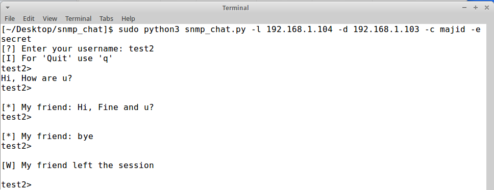

## About
This script wrote base on [SNMP Covert Channel](https://github.com/jevalenciap/snmp_chat "Link"). It used SNMP Protocol for create a **covert channel chat** (peer-to-peer).
For more information about **Covert Channel** [see](https://en.wikipedia.org/wiki/Covert_channel "Link").

----
## Installation
#### Requirements
> scapy

> Python3.*

#### Run
At first you should clone the repository
> git clone https://github.com/majidmc2/snmp_chat

Then install requirements with  **pip3.***
> sudo pip3 install scrapy

After That open the new terminal and run snmp_chat.py, 
> cd snmp_chat

> sudo python3 snmp_chat.py -l [LOCAL_IP] -d [DESTINATIO_IP] -c [COMMINUTY (Optional)] -e [AES_KRY (Optional)] -p [UDP_PORT (Optional)]
 

 

## Example
On 192.168.1.103:

On 192.168.1.104:

On [Wireshark](https://www.wireshark.org/ "Link"):

----
